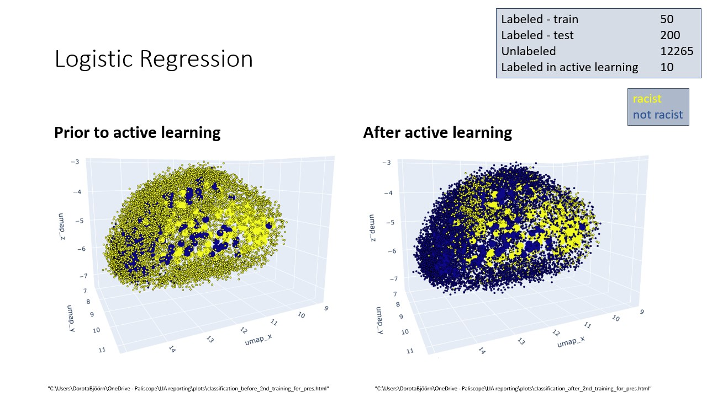
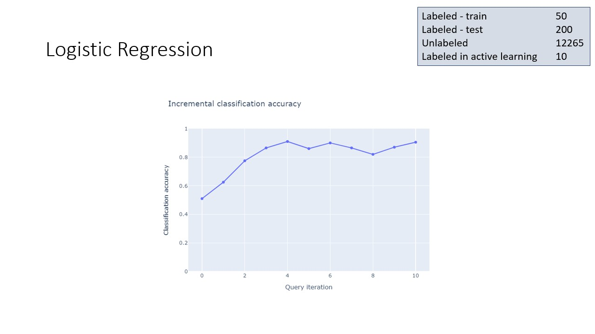

# Info about data and notebooks

Forum dataset has been:
* cleand from url
* chunked into max token lengt 256 using tokenizer = BertTokenizer.from_pretrained("bert-base-uncased")
* embeddings were calculated using model = SentenceTransformer('all-MiniLM-L6-v2')
* labeled with zeroshot classification (classifier = pipeline("zero-shot-classification", model="facebook/bart-large-mnli"))

For initial annotation, text chunks with top scores from zeroshot classification were assesed manually till 100 positive and 100 negative labels were identified.
Hypothesis for labeling was "this text is racist"

---------------------------------------------------------------------------------------------------------------------------------------
*supervised.ipynb*\
Manually annotated dataset of 100 positive and 100 negative labels with hypothesis "This text is racist" from forum are used to train Logistic Regression and Random Forrest models.

---------------------------------------------------------------------------------------------------------------------------------------
*active_learning.ipynb*\
Active learning is used to annotate most interesting data. Inital annotated data is 200 datapoints from annotate.ipynb plus any which have been unnotated in earlier runs. Annotated data is split into train data to fit initial learner and test data to evalate accurac score for each iteration. Analysis in 384 dimensions; visualization in 3.
Basic ActiveLearner is initialized with estimators: LogisticRegression or RandomForrest and uncertaquery strategy as query strategy.
Most uncertain points are queried and new accuracy score calculated a predefined number of times.
Query results are saved together with plots and model.

  
# Active learning result example

